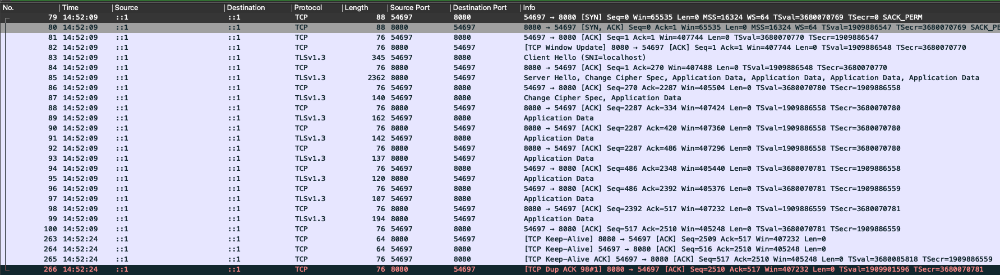
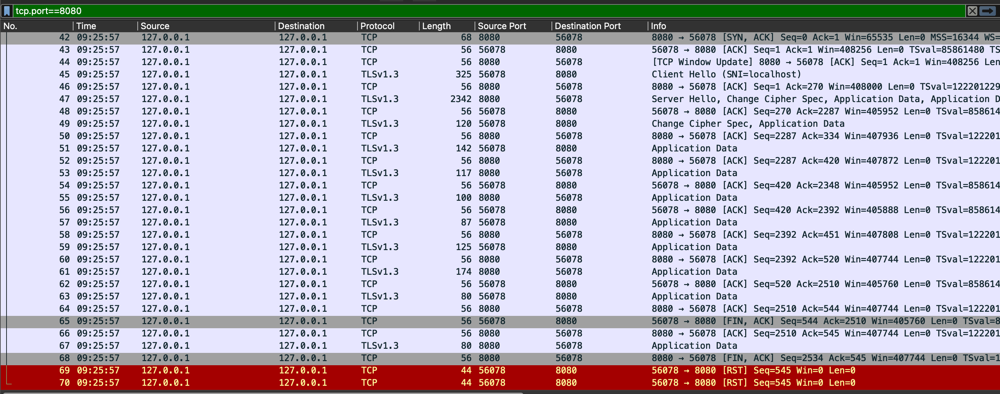
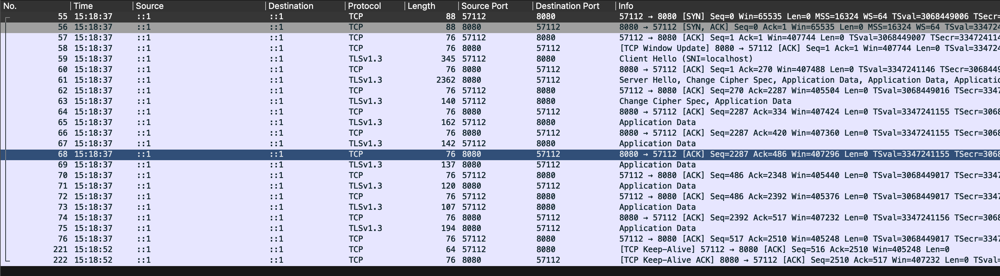

# long-live-conn

Is a repository that contains a client and server written in Golang that can maintain a long-lived HTTP2 connection. The following variables are configurable in the server and client through ENV variables:

## Client

- CLIENT_KEEP_ALIVE_SECONDS - The interval in seconds between keep alives. Default is `15` by the net/dialer package.
- CLIENT_KEEP_ALIVE_ENABLED - Enables keep alives in the client. If the server has keep alives enabled, the client will not send keep alives. Default is `true`
- CLIENT_TLS_DISABLE_VERIFICATION - Disables TLS verification. Default is `true`
- CLIENT_REQUEST_INTERVAL_SECONDS - The interval in seconds between requests. Default is `30` seconds
- CLIENT_SERVER_URL - The URL of the server to connect to. Default is `http://localhost:8080`


## Server

- SERVER_KEEP_ALIVE_ENABLED - Enables keep alives in the server. Default is `true`
- SERVER_KEEP_ALIVE_INTERVAL_SECONDS - The interval in seconds between keep alives. Default is `15` by the net/TCPConn package.
- SERVER_TLS_CERT_PATH - The path to the TLS certificate. Default is `cert.pem`
- SERVER_TLS_KEY_PATH - The path to the TLS key. Default is `server.key`


## Examples

This section lists some examples and their corresponding Wireshark captures.

### Keep alive by the server

This requires no change in the config, it's the default.



Note: that the Wireshark traces were taken on MacOS. The default TCP keep-alive in Go is 15 seconds. 
If you disable the TCP keep alive in the client via `CLIENT_KEEP_ALIVE_ENABLED`, the client will send a RST
packet directly after sending the HTTP request. In this case the client will not receive a TCP keep alive packet from the server. See below image for an example.




### Keep alive by the client

To disable keep alives in the server, set ENV `SERVER_KEEP_ALIVE_ENABLED` to `false`. In this case the client will send keep alives.



## Docker images

```
dariomader/long-live-connection-server:v0.0.2
dariomader/long-live-connection-client:v0.0.2
```
